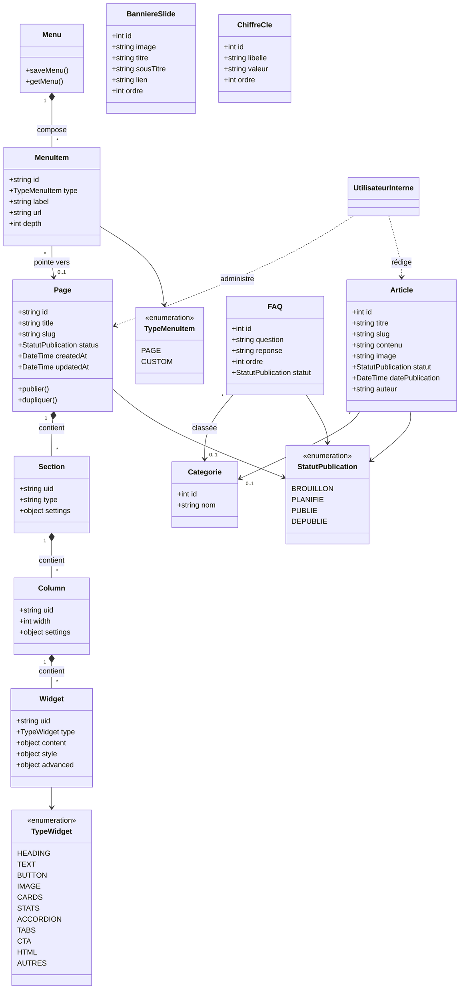

# CAMA — Diagramme de classes

> Modèle de domaine de la solution CAMA (site institutionnel + plateforme d'enrôlement + back-office + CMS).
> Élaboré à partir du **cahier des charges** (`docs/cdc_extracted.txt`) et du **code actuel du prototype**
> (`assure/assure-data.js`, `admin/cms/cms-data.js`, `admin/admin-shell.js`).
>
> Convention de provenance :
> - 🟢 **présent dans le prototype** (structures réellement codées)
> - 🟡 **cible CDC** (spécifié, pas encore implémenté dans le prototype statique)

---

## 1. Diagramme métier — Utilisateurs, Enrôlement, Traçabilité

```mermaid
classDiagram
    direction TB

    %% ───────────── Utilisateurs & accès ─────────────
    class Utilisateur {
        <<abstract>>
        +int id
        +string nom
        +string prenom
        +string email
        +string motDePasseHash
        +bool deuxFA
        +DateTime dateCreation
        +DateTime derniereConnexion
        +seConnecter()
        +reinitialiserMotDePasse()
    }

    class AssurePrincipal {
        +string matricule
        +string numeroInformatique
        +string grade
        +string categorie
        +string numeroCim
        +string numeroCama
        +string numeroIup
        +Sexe sexe
        +string armee
        +string region
        +string corps
        +string service
        +string section
        +string sousSection
        +string telephones
        +string personneAPrevenir
        +string telPersonneAPrevenir
        +StatutCompte statut
        +creerCompte()
        +ajouterMembre()
        +soumettreDossier()
        +peutSoumettreDossiers() bool
        +exporterFormulaireFamilial() PDF
    }

    class StructureOrganisationnelle {
        +string[] armees
        +string[] categories
        +string[] groupesSanguins
        +Region[] regions
    }
    note for StructureOrganisationnelle "Configurable back-office\n(parametres.html, clé cama_org_structure)\nHiérarchie Région > Corps > Service > Section > Sous-section"

    class Region {
        +string id
        +string libelle
        +Corps[] corps
    }

    class UtilisateurInterne {
        +RoleInterne role
        +bool actif
        +creerCompteInterne()
        +affecterDossier()
    }

    class Visiteur {
        <<acteur>>
        +consulterPagesPubliques()
        +envoyerMessageContact()
    }

    class RoleInterne {
        <<enumeration>>
        GESTIONNAIRE
        SUPERVISEUR
        ADMINISTRATEUR
        DIRECTION
    }

    class Permission {
        +string code
        +string libelle
    }

    class StatutCompte {
        <<enumeration>>
        EN_ATTENTE_VALIDATION
        ACTIF
        DESACTIVE
    }

    Utilisateur <|-- AssurePrincipal
    Utilisateur <|-- UtilisateurInterne
    UtilisateurInterne --> RoleInterne : a un
    RoleInterne "1" --> "*" Permission : autorise

    %% ───────────── Cœur métier : enrôlement ─────────────
    class MembreFamille {
        +int id
        +string nom
        +string prenoms
        +Sexe sexe
        +Date dateNaissance
        +string lieuNaissance
        +string groupeSanguin
        +string refIdentite
        +string telephone
        +LienParente lien
        +string numeroCama
    }

    class Conjoint {
        +string refActeMariage
        +string profession
        +string lieuResidence
    }
    note for Conjoint "Marié(s) à la mairie uniquement (section 2)"

    class Enfant {
        +string refActeScolariteEtatCivil
        +string nomPrenomsParent
    }
    note for Enfant "0 à 26 ans, du plus âgé au plus jeune (section 3)\nlibellé parent = mère (ou père si personnel féminin)"

    class Dossier {
        +int id
        +string ref
        +string beneficiaire
        +StatutDossier statut
        +Date dateSoumission
        +Date dateDecision
        +string motifRefus
        +bool validationDeuxNiveaux
        +soumettre()
        +valider()
        +refuser(motif)
        +demanderComplement(pieces)
        +mettreEnAttente()
        +genererAccuse() PDF
    }

    class LienParente {
        <<enumeration>>
        CONJOINT
        ENFANT_BIOLOGIQUE
        ENFANT_CONJOINT
        PARENT
        AUTRE
    }

    class Sexe {
        <<enumeration>>
        MASCULIN
        FEMININ
    }

    class StatutDossier {
        <<enumeration>>
        BROUILLON
        SOUMIS
        EN_INSTRUCTION
        PIECE_MANQUANTE_DEMANDEE
        EN_ATTENTE_SUPERVISION
        VALIDE
        REFUSE
    }

    AssurePrincipal "1" --> "*" MembreFamille : enrôle
    AssurePrincipal "1" --> "*" Dossier : soumet
    AssurePrincipal "*" --> "1" StructureOrganisationnelle : rattaché à
    StructureOrganisationnelle "1" *-- "*" Region : contient
    MembreFamille <|-- Conjoint
    MembreFamille <|-- Enfant
    Dossier "1" --> "1" MembreFamille : concerne
    Dossier --> StatutDossier
    Dossier "*" --> "0..1" UtilisateurInterne : affecté à (gestionnaire)
    MembreFamille --> LienParente
    MembreFamille --> Sexe

    %% ───────────── Pièces & traçabilité ─────────────
    class PieceJustificative {
        +int id
        +TypePiece type
        +string nomFichier
        +string mimeReel
        +int tailleOctets
        +StatutPiece statut
        +DateTime dateUpload
        +int version
        +bool scanAntivirusOk
        +telecharger() urlSignee
    }

    class TypePiece {
        +string code
        +string libelle
    }

    class StatutPiece {
        <<enumeration>>
        SOUMISE
        VALIDEE
        MANQUANTE
        REFUSEE
    }

    class JournalEntry {
        +DateTime date
        +string libelle
    }

    class Message {
        +AuteurMessage auteur
        +string texte
        +DateTime date
    }

    class AuteurMessage {
        <<enumeration>>
        ASSURE
        GESTIONNAIRE
    }

    class JournalAudit {
        +int id
        +string action
        +string cible
        +DateTime horodatage
        +string adresseIP
    }
    note for JournalAudit "Journal en lecture seule (CDC 9.9)"

    Dossier "1" *-- "*" PieceJustificative : contient
    Dossier "1" *-- "*" JournalEntry : journalise
    Dossier "1" *-- "*" Message : fil de discussion
    PieceJustificative --> TypePiece
    PieceJustificative --> StatutPiece
    Message --> AuteurMessage
    Utilisateur "1" --> "*" JournalAudit : trace les actions

    %% ───────────── Notifications & communication ─────────────
    class Notification {
        +int id
        +string type
        +string titre
        +string contenu
        +string lien
        +DateTime date
        +bool lu
        +marquerLu()
    }

    class ContactMessage {
        +string objet
        +string email
        +string message
        +string fichierJoint
        +DateTime date
    }

    Utilisateur "1" --> "*" Notification : reçoit
    Dossier "1" --> "*" Notification : déclenche
    Visiteur ..> ContactMessage : envoie

    %% ───────────── Paramétrage & exports ─────────────
    class ParametreSysteme {
        +int dureeRetentionPieces
        +bool validationDeuxNiveaux
        +string[] motifsRefusPredefinis
        +string[] modelesEmail
        +string regleAffectation
    }

    class Export {
        +int id
        +FormatExport format
        +string perimetre
        +string filtres
        +DateTime date
        +generer()
    }

    class FormatExport {
        <<enumeration>>
        CSV
        XLSX
        PDF
    }

    ParametreSysteme "1" --> "*" TypePiece : définit pièces requises
    ParametreSysteme "1" --> "*" LienParente : lie pièces ↔ parenté
    UtilisateurInterne "1" --> "*" Export : produit
    Export --> FormatExport
```

---

## 2. Diagramme CMS — Site institutionnel administrable

---

## 3. Correspondance provenance (code ↔ CDC)

| Classe | Source | Référence |
|---|---|---|
| Utilisateur / AssurePrincipal | 🟢 + 🟡 | `assure-data.js` (ASSURE_PROFILE, registerAssure, champs militaires) ; CDC §5, §8.1 |
| StructureOrganisationnelle / Region | 🟢 | `assure-data.js` (cama_org_structure, getOrgStructure) ; `admin/parametres.html` onglet Structure militaire |
| UtilisateurInterne / RoleInterne | 🟢 | `assure-data.js` loginAdmin ; `dashboard.html` role-select ; CDC §5.2 |
| Permission (matrice de droits) | 🟡 | CDC §5.2 |
| MembreFamille / Conjoint / Enfant | 🟢 | `assure-data.js` (dossier + champs formulaire officiel) ; `ajouter-membre.html` ; sections 2 et 3 du formulaire |
| Dossier / StatutDossier | 🟢 | `assure-data.js` DEFAULT_DOSSIERS, submitDossier ; CDC §8.4, §9.3 |
| PieceJustificative / StatutPiece / TypePiece | 🟢 + 🟡 | `assure-data.js` PIECE_LABELS, pieces[] ; CDC §8.3.4, §9.4 |
| JournalEntry / Message | 🟢 | `assure-data.js` journal[], messages[] |
| JournalAudit | 🟡 | `admin/audit.html` ; CDC §9.9 |
| Notification | 🟢 | `assure-data.js` notifs ; `admin-shell.js` ; CDC §8.6, §9.6 |
| ContactMessage | 🟡 | `contact.html` ; CDC §7.1 |
| ParametreSysteme | 🟡 | `admin/parametres.html` ; CDC §9.8 |
| Export / FormatExport | 🟡 | `admin/exports.html` ; CDC §9.5 |
| Page / Section / Column / Widget | 🟢 | `cms-data.js`, `page-builder.html` |
| Menu / MenuItem | 🟢 | `cms-data.js`, `menus.html` |
| Article / BanniereSlide / ChiffreCle / FAQ | 🟢 | `admin/cms/*.html` ; CDC §7.3 |

---

### Notes de modélisation
- Dans le **prototype**, `Dossier` porte directement les champs du membre (modèle dénormalisé en localStorage). Le modèle **cible** sépare `MembreFamille` et `Dossier` (un dossier = l'instruction d'un membre), conformément au CDC.
- La **validation à deux niveaux** (gestionnaire → superviseur, statut `EN_ATTENTE_SUPERVISION`) est paramétrable via `ParametreSysteme.validationDeuxNiveaux`.
- En cas de décès de l'assuré, les ayants droit restent couverts 6 mois (CDC §2.4) — règle métier à porter sur `MembreFamille` (non encore modélisée comme attribut).
- Le module **prestations / remboursements / cotisations** est explicitement **hors périmètre** (CDC §4.2) — non modélisé.
